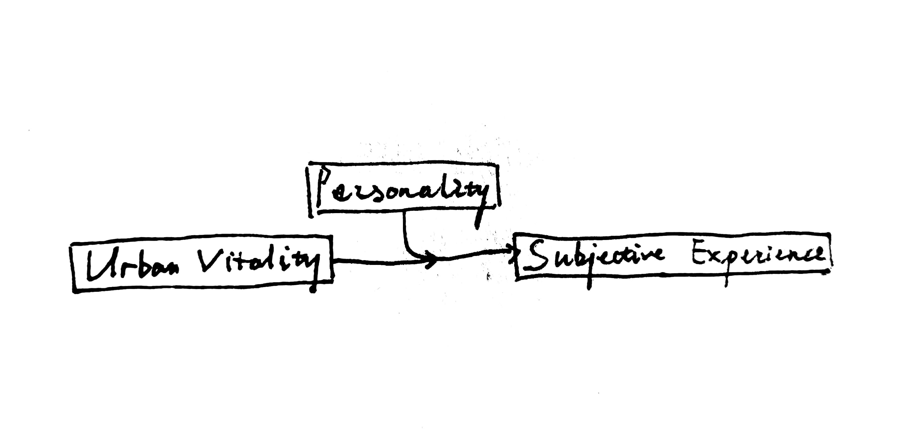
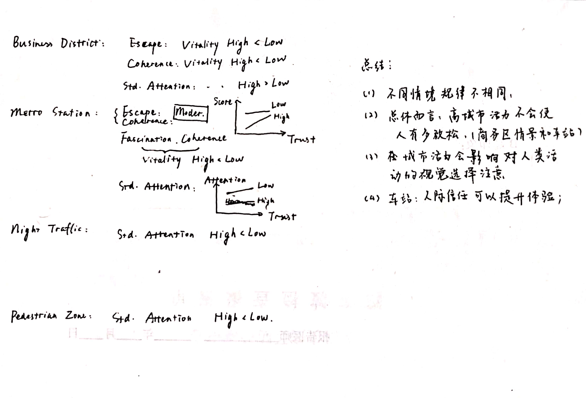

## Introduction

This is a Rmarkdown notebook representing primary results of statistical analysis. First, we will briefly introduce the question to be explored. In the field of urban planning, *urban vitality* is an important concept, firstly brought up by Jane Jacobs. Previous research works have developed several metrics to measure the construct. Specifically in this study, the concept refer to the intensity of human activity in a specific urban area, and is treated as between-subject dummy variable: video with high or low vitality is played. We expect that level of urban vitality can significantly predict the subjective experience, and personality factor (specifically, interpersonal trust score in this study) play a role of moderation, illustrated as below. 

## Before the analysis

At first, we should import the data from the directory. The data is in form of **.Rdata** format, and was preprocessed by R code scripts (2021\*\*\*\*\_DataPreprocessing.R). Furthermore, several packages are imported, listed below.

```{r include=FALSE}
rm(list = ls())
load("20200201_Data.RData"); load("20200219_EyeData_plus.RData")
library(bruceR)
library(car)
library(phia)
library(psych)
library(lavaan)
library(nlme)
library(lme4)
library(performance)
library(lmerTest)
library(magrittr)
library(tidyverse)
```

## Exploratory data analysis (EDA)

In this part, exploratory analysis will be performed.

> Descriptive Stat

Firstly, we represent descriptive statistical results. The most important of them are mean and standard deviation. Here, the function **psych::describe()** and **describeBy()** are used to report characteristics of data from both questionnaire and tobii eye-tracker.

```{r}

# descriptive stat results of personality data.
describe(personality %>% select(Neuroticism:`Interpersonal Trust`))
# visualization: data distribution.
ggplot(personality %>% select(Neuroticism:`Interpersonal Trust`) %>% gather(everything(), key = 'Variable', value = 'Score')) +
  geom_histogram(aes(x = Score), fill = "#CC6666") +
  facet_wrap(~ Variable, nrow = 2)

# descriptive stat results of visiting experience: note, there's 2 ways to code, in which multiple columns can be analyzed at the same time.
#   method 1: old coding style, yield an intermediate variable "for_descriptive_stat"
for_descriptive_stat <- left_join(visit_scale_score, personality[c("Key", "Level of Vitality")], by = "Key")
describeBy(x = select(for_descriptive_stat, Satisfaction:Compatibility), 
  group = list(for_descriptive_stat$Scenario, for_descriptive_stat$`Level of Vitality`))

#   method 2: pipe style. 
# left_join(visit_scale_score, personality[c("Key", "Level of Vitality")], by = "Key") %>% 
#   {describeBy(x = select(., Satisfaction:Compatibility), 
#     group = list(.$Scenario, .$`Level of Vitality`))}

# data visualization:
ggplot(for_descriptive_stat %>% gather(Satisfaction:Compatibility, key = 'Variable', value = 'Score'), 
       aes(x = `Level of Vitality`, y = Score)) + 
  geom_boxplot(aes(fill = Scenario), position = position_dodge(0.8)) +
  geom_point(aes(color = Scenario), position = position_jitterdodge(dodge.width = 0.8, jitter.height = 0.06), alpha = 0.35) +
  facet_wrap(~ Variable, nrow = 5)
  

```

Please note that for "method 2" above, i.e. the latter code style, **{} is necessary**. By using it, the pipe symbol will plug the results before *only into several location* (where "." appear), *rather than the first argument*.

Eye-tracking metrics are also analyzed, see codes below.

```{r}

# descriptive analysis
for_descriptive_stat <- eye_data %>% select(Key:`Level of Vitality`, Average_duration_of_whole_fixations, Average_peak_velocity_of_saccades, Average_amplitude_of_saccades, Average_pupil_size, Total_amplitude_of_saccades:Saccade_frequency, Vitality_attention, Vitality_attention_standardized)
describeBy(x = select(for_descriptive_stat, -(Key:`Level of Vitality`)), 
  group = list(for_descriptive_stat$Scenario, for_descriptive_stat$`Level of Vitality`))

# visualization: distribution
ggplot(for_descriptive_stat %>% gather(-(Key:`Level of Vitality`), key = 'Variable', value = 'Score')) +
  geom_histogram(aes(x = Score), fill = "#7777DD") +
  facet_wrap(~ Variable, ncol = 3, scales = "free")

```

> Reliability

Next, the reliability of the measurement tool should be validated. In the code below, Cronbach's $\alpha$ coefficient of ITS and four subscale of PRS is computed.

```{r}
trait_trust %>% select(-Key) %>% psych::alpha()
visit_scale %>% select(Escape1:Escape5) %>% psych::alpha()
visit_scale %>% select(Fascination1:Fascination5) %>% psych::alpha()
visit_scale %>% select(Coherence1:Coherence4) %>% psych::alpha()
visit_scale %>% select(Compatibility1:Compatibility5) %>% psych::alpha()
vital_subjective %>% psych::alpha()
```

The reliability of ITS is somewhat not good enough ($\alpha$ \< 0.7), yet coefficient of PRS is quite high (greater than 0.8).

> Validity

For validity, we only concerned the validity of PRS, because we researchers have referred several versions of scale and slightly modified some scale items, yet other scales are used as they originally be. Both constructive validity and criterion validity is considered. Constructive validity is checked with the package **lavaan**, based on the theory of confirmatory factor analaysis.

```{r}
# constuctive validity: CFA
PRS.model <- 'Escape =~ Escape1 + Escape2 + Escape3 + Escape4 + Escape5
              Fascination =~ Fascination1 + Fascination2 + Fascination3 + Fascination4 + Fascination5
              Coherence =~ Coherence1 + Coherence2 + Coherence3 + Coherence4
              Compatibility =~ Compatibility1 + Compatibility2 + Compatibility3 + Compatibility4 + Compatibility5'

fit <- cfa(PRS.model, data = visit_scale)
summary(fit, fit.measures = TRUE, standardized = TRUE, rsquare = TRUE)
```

Criterion validity is analyzed based on theory of factor analysis and canonical correlation. Each participant will watch four street view video, and report subjective vitality (note: different to urban vitality) level for 2 times. By conducting **factor analysis** (FA), we expect estimating *restorative* "factor score" of each scenario from PRS scale for each participant, and these factor scores are predictors. The corresponding criterion is the change of subjective vitality. Then the **canonical correlation** coefficient is computed.

```{r}
# criterion validity: canonical correlation
# prediction variables are organized in list.
prs_cluster <- visit_scale_score %>% ungroup %>%  select(-RecordedDate, -Satisfaction) %>% 
  split(.$Scenario) %>% map(~arrange(., Key) %>% select(-Scenario, -Key))

# criterion
criterion <- vital_subjective_score %>% ungroup %>% select(-(vital_1:vital_7)) %>% 
  spread(stage, `Subjective Vitality`) %>% mutate(`Change of Subjective Vitality` = after - before) %>% 
  arrange(Key) %>% select(`Change of Subjective Vitality`)

# measure whether the four factors can converge to a single construct: Perceived Restorative.
prs_cluster %>% map(~ fa.parallel(., fa = "both"))
# results show that four factors should be reduced into only 1 dimension except for metro scenario (2 dimension)

# then we start the verification. 
# There's one missing value in metro scenario, which should be plugged in.
prs_cluster$`Metro Station` <- prs_cluster$`Metro Station` %>% fill(everything())

# for each scenario, factor analysis is conducted with its factor score computed.
# factor scores in four scenario will be in one record (row), as X with four columns.
fa_scores <- prs_cluster %>% map_df(~factanal(., 1, scores = "Bartlett") %>% .$scores)

# compute the canonical correlation
cancor_result <- cancor(fa_scores, criterion)

# test the corelation coefficient
corcoef.test<-function(r, n, p, q, alpha=0.05){
  m<-length(r); Q<-rep(0, m); lambda <- 1
  for (k in m:1){
    lambda<-lambda*(1-r[k]^2);
    Q[k]<- -log(lambda)
  }
  s<-0; i<-m
  for (k in 1:m){
    Q[k]<- (n-k+1-1/2*(p+q+3)+s)*Q[k]
    chi<-1-pchisq(Q[k], (p-k+1)*(q-k+1))
    if (chi>alpha){
    i<-k-1; print(chi); break
    }
    s<-s+1/r[k]^2
    }
  i
}
# will return the number of significant coefficient.

for (alpha in seq(0.003, 0.004, by = 0.0005)){
  num <- corcoef.test(cancor_result$cor, 72, 4, 1, alpha = alpha)
  print(alpha); print(num)
}


  
  
```

## Producing complete tidy-data and handling the outlier

To analyze the effect hypothesized, we firstly combine all data together.

```{r}
# put all types of dataframe together to form a complete one:
aggregate_data <- inner_join(personality, visit_scale_score, by = "Key") %>% 
  left_join(eye_data, by = c("Key", "Scenario", "Level of Vitality")) %>% 
  select(RecordedDate, Key, `Level of Vitality`, Scenario, everything()) %>% 
  mutate(`Level of Trust` = if_else(`Interpersonal Trust` >= median(.$`Interpersonal Trust`), "High", "Low") %>% factor()) %>% ungroup()

```


We try to kick the outliers. Eye-tracking metrics seldom follow normal distribution, therefore the criteria of outliers is based on distribution of data rather than standardized *Z*-score.

```{r}

# outlier removing function
remove_outliers <- function(x, na.rm = TRUE, ...) {
  qnt <- quantile(x, probs=c(.25, .75), na.rm = na.rm, ...)
  H <- 1.5 * IQR(x, na.rm = na.rm)
  y <- x
  y[x < (qnt[1] - H)] <- NA
  y[x > (qnt[2] + H)] <- NA
  y
}

# apply the function to DV
aggregate_data_screen <- aggregate_data %>% mutate_at(vars(Satisfaction:Vitality_attention_standardized), remove_outliers)

```

## Analysis: adjunctive stat analysis

By drawing the graph, we could see the distribution of the data, maybe giving us insights for later analysis.

```{r}
# exploratory data insight: ggplot to find hidden rules.
# for different scenario and PRS subscale: facet 4 by 4.
ggplot(data = aggregate_data_screen %>% gather(Escape:Compatibility, key = 'variable', value = 'Score'),
       aes(x = `Interpersonal Trust`, y = Score)) +
  geom_point(aes(color = `Level of Vitality`),  shape = 16, alpha = 0.4) +
  geom_smooth(aes(color = `Level of Vitality`), method = "lm") +
  facet_grid(variable ~ Scenario, scales = "free_y") +
  theme(legend.position = "bottom")

# for different vitality level and PRS subscale: facet 2 by 4 
ggplot(data = aggregate_data %>% gather(Escape:Compatibility, key = 'variable', value = 'Score'),
       aes(x = `Interpersonal Trust`, y = Score)) +
  geom_point(aes(color = `Scenario`),  alpha = 0.4) +
  geom_smooth(aes(color = `Scenario`), method = "lm") +
  facet_grid(variable ~ `Level of Vitality`, scales = "free_y")

# fixation is significant
ggplot(aggregate_data_screen %>% 
         gather(Average_duration_of_whole_fixations, Average_amplitude_of_saccades, key = 'variable', value = 'Score') %>% 
         mutate(variable = fct_relabel(variable, ~ str_replace_all(., '_', ' ') %>% 
                                         str_remove(., ' whole') %>% paste(c("[°]", "[ms]")))), 
       aes(x = `Interpersonal Trust`, y = Score)) +
  geom_point(aes(color = `Level of Vitality`), shape = 16, alpha = 0.4) +
  geom_smooth(aes(color = `Level of Vitality`), method = "lm") +
  scale_y_continuous(name = "Value") +
  facet_grid(variable ~ Scenario, scales = "free_y") +
  theme(legend.position = "bottom")

```


Firstly, we want to ensure whether all four dimension of PRS scale can properly reflect the restoration construct, which predict satisfaction based on ART.
```{r}
aggregate_data %>% select(Satisfaction:Compatibility) %>% corr.test(use = "pairwise")

```

Next, we want to explore the relationship between restoration and visual attention level. According to attention restorative theory, one will pay more involuntary attention to the environment if it is perceived as restorative. Yet we need a single metric to represent restoration level... maybe PCA is a good idea?
```{r}
# aggregate_data, yyds.
for_pca <- aggregate_data %>% select(Escape:Compatibility) 
# Scree plot: how many components should be extracted?
fa.parallel(for_pca, fa="pc", n.iter=100, show.legend=FALSE, main="Scree plot with parallel analysis")
# principal analysis and output the principal score.
pca <- principal(for_pca, nfactors = 1, scores = TRUE)
aggregate_data_plus <- aggregate_data %>% mutate(Restoration = pca$scores)

# Compute the correlation to verify the ART.
aggregate_data_plus %>% select(Total_duration_of_whole_fixations:Saccade_frequency, Average_pupil_size) %>% 
  map(~ cor.test(., aggregate_data_plus$Restoration))

# another coding style...
corr.test(aggregate_data_plus %>% select(Restoration), aggregate_data_plus %>% select(Total_duration_of_whole_fixations:Saccade_frequency, Average_pupil_size), use = "pairwise.complete.obs")

```

Analysis the gender difference:
```{r}
participant <- read_csv("participant.csv", col_types = cols(
  gender = col_factor(levels = c("0", "1")),
  Participant = col_character())) %>% select(-Recording) %>% unique() 

aggregate_data_plus %<>% left_join(participant, by = c("Key" = "Participant")) %>% 
  mutate(gender = factor(gender, labels = c("Female", "Male"))) %>% 
  select(RecordedDate, Key, Name, Gender = gender, Scenario:Compatibility, Restoration, everything())

# three_factor_aov <- aov(Restoration ~ Scenario * Gender * `Level of Vitality` + Error(Key/Scenario), data = aggregate_data_plus)

# repeated-measure anova: using Anova() in car package.
aggregate_data_wide <- aggregate_data_plus %>% select(Key, Name, `Level of Vitality`, Scenario, Gender, Restoration) %>% spread(Scenario, Restoration)
fit_repeated <- lm(cbind(`Business District`, `Metro Station`, `Night Traffic`, `Pedestrian Zone`) ~ Gender * `Level of Vitality`, data = aggregate_data_wide)
in_repeated <- expand.grid(`Scenario` = c("Business District", "Metro Station", "Night Traffic", "Pedestrian Zone"))
three_factor_aov <- Anova(fit_repeated, idata = in_repeated, idesign = ~ Scenario, type = 'III') 
summary(three_factor_aov, multivariate = FALSE, univariate = TRUE)

# confirm the interaction
# method 1: using function in package bruceR.
MANOVA(aggregate_data_plus %>% rename(Vitality = `Level of Vitality`), subID = "Key", dv = "Restoration", 
       between = c("Gender", "Vitality"), within = "Scenario")
# method 2: testInteractions().
# note: because the factor should contain space, we should rename all factors.
fit_repeated_v2 <- lm(cbind(CBD, Metro, Night, Pedestrian) ~ Gender * Vitality, data = aggregate_data_wide %>%
                        rename(Vitality = `Level of Vitality`, CBD = `Business District`, 
                               Metro = `Metro Station`, Night = `Night Traffic`, Pedestrian = `Pedestrian Zone`))
in_repeated_v2 <- expand.grid(`Scenario` = c("CBD", "Metro", "Night", "Pedestrian"))
testInteractions(fit_repeated_v2, idata = in_repeated_v2, fixed = "Gender", across = "Vitality")
testInteractions(fit_repeated_v2, idata = in_repeated_v2, fixed = "Vitality", across = "Gender")


# visualization
aggregate_data_summary <- aggregate_data_plus %>% 
  select(Key, Gender, `Level of Vitality`, Restoration) %>% 
  group_by(Gender, `Level of Vitality`) %>% 
  summarise(mean = mean(Restoration, na.rm = TRUE), 
            se = sd(Restoration, na.rm = TRUE) / (n()-1))

ggplot(aggregate_data_summary, aes(x = Gender, y = mean, group = `Level of Vitality`)) +
  geom_bar(aes(fill = `Level of Vitality`), stat = "identity", 
           position = "dodge", alpha = 0.60) +
  geom_errorbar(aes(ymin = mean-se, ymax = mean+se), stat = "identity",
                position = position_dodge(0.9), width = .35) +
  scale_y_continuous(name = "Restoration")+
  theme(legend.position = "bottom")


ggplot(aggregate_data_summary, aes(x = Gender, y = mean, group = `Level of Vitality`)) +
  geom_bar(aes(fill = `Level of Vitality`), stat = "identity", 
           position = "dodge", alpha = 0.20) +
  geom_errorbar(aes(ymin = mean-se, ymax = mean+se), stat = "identity",
                position = position_dodge(0.9), width = .35) +
  scale_y_continuous(name = "Restoration") +
  theme(legend.position = "bottom") +
  geom_point(aes(x = Gender, y = Restoration, color = `Level of Vitality`), 
             data = aggregate_data_plus, position = position_jitterdodge(dodge.width = 0.9))


```


## Analysis: main hypothesis

Our plan is choosing all dependent variables to form a complete dataset. Then write a function for analyzing simply one column of dependent variable. All analyzing process would be iterated by **purrr::map()** function.

```{r}

# all dependent variables: dv_columns.
dv_columns <- aggregate_data_screen %>% select(Escape:Compatibility, Average_duration_of_whole_fixations, Average_peak_velocity_of_saccades, Average_amplitude_of_saccades, Average_pupil_size, Total_amplitude_of_saccades:Saccade_frequency, Vitality_attention, Vitality_attention_standardized)
dv_names <- names(dv_columns)

```

We first adopt three-way mixed-designed ANOVA, in which level of vitality and trust is between-subject factor, and scenario is within-subject factor. Unfortunately, no variable is significant...

```{r include=FALSE}
#  anova.
mixed_anova <- function(test_column){
  # the argument "test_column" is dependent variable.
  restructured <- aggregate_data_screen %>% select(Key:`Interpersonal Trust`, `Level of Trust`) %>% add_column(var = test_column) %>% rename(Vitality = `Level of Vitality`, Trust = `Level of Trust`)
  
  fit <- aov(var ~ Vitality * Trust * Scenario + Error(Key/Scenario), restructured)
  summary(fit)
}

dv_columns %>% map(mixed_anova)

```

Therefore, a more advanced model is adopted. Hierarchical linear model (HLM) is suitable for analysis with great variance between groups. Here, sceanrio variable is regarded as grouping variable to seperate more variance.

```{r}

hlm_framework_v2 <- function(test_column){
  
  # HLM: hierarchical linear model:
  #   one dependent variable is picked up and added to the last column, 
  #   to form a complete dataset named "restructured".
  
  restructured <- aggregate_data_screen %>% select(Key:`Interpersonal Trust`) %>% add_column(var = test_column) %>% rename(Vitality = `Level of Vitality`, Trust = `Interpersonal Trust`)

  # building the model.
  model2 <- lmer(var ~ Vitality * Trust + (1 | Scenario), data = restructured, na.action = na.exclude)
  # model3 <- lmer(var ~ Vitality * Trust + (1 | Scenario) + (1 | Key), data = restructured, na.action = na.exclude)
  # model_inter <- lmer(var ~ Vitality * Trust + (Vitality | Scenario), data = restructured, na.action = na.exclude)
  
  # return zone
  return(model2)
}
hlm_results <- dv_columns %>% map(hlm_framework_v2)
hlm_results %>% map(summary)

```

In fact, the results of HLM analysis is not good enough. From the exploratory plotting graph we can clearly see the influential pattern of data varies a lot among different scenarios. Thus we analyse the moderation effect separately within each scenario.

```{r}

scene_grouped <- aggregate_data_screen %>% split(.$Scenario)

moderation_on_one_scene <- function(one_scene){
  # center the moderate variable: ITS
  one_scene <- one_scene %>% mutate(`Interpersonal Trust Centered` = scale(`Interpersonal Trust`, center = TRUE, scale = TRUE))
  
  moderation_within_scene <- function(dv_name){
    #dv_name is a character string
    chosen <- one_scene %>% select(Vitality = `Level of Vitality`, Trust = `Interpersonal Trust Centered`, var = all_of(dv_name))
    
    fit0 <- lm(var ~ Vitality + Trust, data = chosen, na.action = na.exclude)
    fit1 <- lm(var ~ Vitality * Trust, data = chosen, na.action = na.exclude)
    comparison <- anova(fit0, fit1)
    return(list(fit0 = fit0, fit1 = fit1, compare = comparison))
  }
  
  fit_batch <- dv_names %>% map(moderation_within_scene)
  fit_batch <- fit_batch %>% set_names(dv_names)
  return(fit_batch)
}

fit_folded_batch <- scene_grouped %>% map(moderation_on_one_scene)
fit_folded_batch$`Business District` %>% map(~ map(., summary))
fit_folded_batch$`Metro Station` %>% map(~ map(., summary))
fit_folded_batch$`Night Traffic` %>% map(~ map(., summary))
fit_folded_batch$`Pedestrian Zone` %>% map(~ map(., summary))


```



```{r}

ggplot(aggregate_data_screen, aes(x = `Interpersonal Trust`, y = Vitality_attention_standardized)) +
  geom_point(aes(color = `Level of Vitality`),  shape = 16, alpha = 0.4) +
  geom_smooth(aes(color = `Level of Vitality`), method = "lm") +
  scale_y_continuous(name = "Standardized attention on ubban human activities") +
  # facet_wrap( ~ Scenario, scales = "free_y", nrow = 2) +
  facet_grid( ~ Scenario, scales = "free_y") +
  theme(legend.position = "bottom")


```


